# 😺 Simple-App: Automação de ciclo de desenvolvimento CI/CD, com Dockerhub, Argo CD e FastAPI

Olá! Este é um projeto que visa automatizar o processo de desenvolvmento, deployment e execução de uma aplicação simples em FastAPI, com ferramentas de CI/CD.

Para tanto, serão utilizadas as seguintes ferramentas:

- DockerHub para conteinerização;
- FastAPI, uvicorn e jinja2 para aplicação web;
- GitHub Actions para automação GitOps;
- Cluster Kubernetes local com minikube;
- ArgoCD para automação GitOps.

Neste repositório, está contida a aplicação desenvolvida para ser instalada em um cluster Kubernetes local, e atualizada em um ciclo completo de desenvolvimento integrado e integração contínua.

O manifesto desenvolvido para reger o deploy da aplicação no cluster está disponível aqui: [simple-app-manifests](https://github.com/DonaMaxii/simple-app-manifests/).

## 🧩 Aplicativo para teste (Simple-App)

No escopo deste projeto, foi desenvolvida uma pequena aplicação web, que consiste basicamente em uma página HTML de simples construção. 

Essa aplicação foi desenvolvida utilizando Python (mais especificamente Python v. 3.12.3), implementando a framework FastAPI, uvicorn (servidor web ASGI) e jinja2 (template web para python).

Para o main.py, temos a seguinte estrutura de código:

>
    # main.py
    from fastapi import FastAPI, Request
    from fastapi.responses import HTMLResponse
    from fastapi.staticfiles import StaticFiles
    from fastapi.templating import Jinja2Templates

    app = FastAPI()

    templates = Jinja2Templates(directory="templates")
    app.mount("/static", StaticFiles(directory="static"), name="static")

    @app.get("/", response_class=HTMLResponse)
    def home(request: Request):
        return templates.TemplateResponse("index.html", {"request": request})
>

Dessa maneira, temos o requirements.txt contendo as seguintes dependências:

> 
    fastapi
    uvicorn
    jinja2
>

## 🐋 Conteinerização local para teste (DockerHub)

Para que seja possível a disponibilização desse aplicativo, é importante que o mesmo seja fechado em um contêiner.

Para isso, é necessário criar uma imagem Docker. Para tanto, criamos o seguinte dockerfile.yml:

>
    FROM python:3
    WORKDIR /simple-app

    COPY requirements.txt ./
    RUN pip install --no-cache-dir -r requirements.txt

    COPY . .

    EXPOSE 8000

    CMD [ "uvicorn", "main:app" "--host", "0.0.0.0", "--port", "8000" ]
>

Para testar localmente, basta executar os comandos abaixo:

>
    docker build -t simple-app .
    docker run -it --rm --name simple-app simple-app
>

## ⚙️ Criando repositórios para CI/CD

Neste projeto, criamos dois repositórios.

O primeiro será utilizado para armazenar a aplicação, e terá programado um *workflow* no GitHub Actions. Este, por sua vez, automatizará o processo de conteinerização da aplicação para o Dockerhub.

O segundo repositório será utilizado, por sua vez, para armazenar o manifest YAML da aplicação, que regerá o processo de deployment no ArgoCD e no cluster Kubernetes local.

Crie no GitHub os dois repositórios. Neste projeto, nomeamos o primeiro de *simple-app* e o segundo, *simple-app-manifest*.

### ⚙️ Repositório da aplicação

Este repositório hospedará a aplicação FastAPI criada anteriormente. Primeiramente, fazemos o envio dos arquivos para esse repositório pelo *git*:

>
    cd <diretório-local-da-aplicacao>
    git init
    git branch -M main
    git remote add origin git@github.com:<user>/<nome-do-repositorio>.git
    git add .
    git commit -m "feat: aplicação simple-app com dockerfile"
    git push origin main
>

Em seguida, criamos algumas variáveis especiais chamadas _secrets_, nas configurações do repositório no GitHub.

- 1 - Abra a página do repositório no GitHub (ex: http://https://github.com/<user>/simple-app);

- 2 - Clique em "Settings";

- 3 - Em "Security", clique no menu suspenso "Secrets and Variables" --> "Actions";

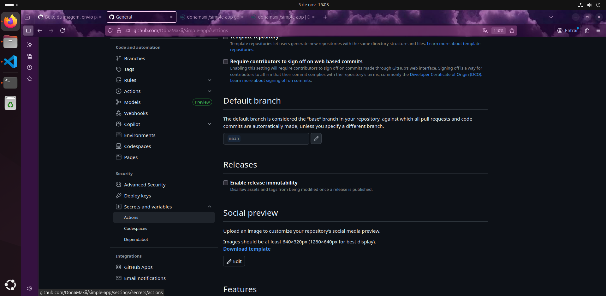

- 4 - Para criar um novo segredo, clique em "New repository secret".

Nesse momento, deverão ser atribuídas os seguintes segredos, que serão referenciados no *workflow* mais à frente:

- **DOCKER_USERNAME**: o nome de usuário no DockerHub

- **DOCKER_PASSWORD**: a senha de usuário no DockerHub

- **SSH_PRIVATE_KEY**: a chave SSH do repositório manifesto, para o envio de commits via SSH.

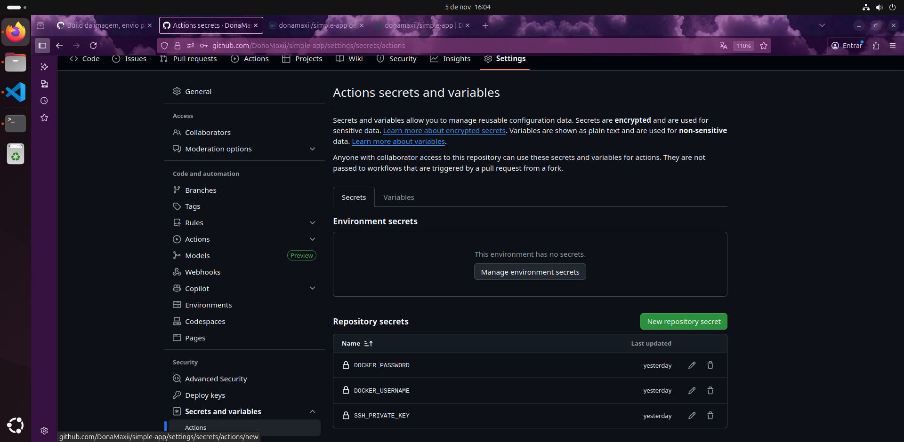

### ⚙️ Repositório do manifesto

Esse repositório especial terá a função de ser a "fonte única da verdade", isto é, regerá o estado do cluster Kubernetes que conterá a aplicação, sendo primordial na estrutura CI/CD. 

O repositório conterá o arquivo manifest, escrito no formato YAML, que conterá as informações de deployment e services para a criação do cluster Kubernetes. Ele conterá também um arquivo simples chamado *VERSION*, que registrará o versionamento da imagem, atualizada, enviada ao DockerHub.

Portanto, esse repositório contará com a seguinte estrutura de diretórios:

>
    simple-app-manifest
    |       |___k8s
    |           |___simple-app-manifest.yaml
    |___VERSION
>

- Para começar, crie o manifesto YAML para configuração do cluster Kubernetes:

>
    apiVersion: v1
    kind: Service
    metadata: 
    name: simple-app
    labels:
        app: simple-app
    spec:
    type: ClusterIP
    selector:
        app: simple-app
    ports:
    - name: TCP
        port: 8080
        targetPort: 80
    ---
    apiVersion: apps/v1
    kind: Deployment
    metadata: 
    name: simple-app
    labels:
        app: simple-app
    spec:
    replicas: 2
    selector:
        matchLabels:
        app: simple-app
    template:
        metadata:
        name: simple-app
        labels:
            app: simple-app
        spec:
        containers:
            - name: simple-app
            image: donamaxii/simple-app:latest
            ports:
            - containerPort: 80
            resources:
                requests:
                cpu: 100m
                memory: 64Mi
                limits:
                cpu: 200m
                memory: 128Mi

>

- Em seguida, crie o arquivo VERSION:

>
    0
>

- Finalmente, faça o primeiro *commit* nesse repositório:

>
    cd <diretório-local-do manifest>
    git init
    git branch -M main
    git remote add origin git@github.com:<user>/<nome-do-repositorio-manifest>.git
    git add .
    git commit -m "feat: upload do manifest yaml e VERSION"
    git push origin main
>

### ⚙️ Configurando Workflow para integração contínua (CI)

Nesta etapa, iremos acrescentar ao repositório um arquivo workflow.yaml, que regerá um Workflow no GitHub Actions.

O GitHub Actions é uma ferramenta da plataforma GitHub, que permite a automação de vários processos que, se fossem manuais, seriam repetitivos e suscetíveis a erros por parte do desenvovedor.

Dessa forma, o processo de integração fica totalmente automatizado, reduzindo erros e agilizando o trabalho de desenvolvimento contínuo promovido pela equipe.

Para tanto, precisamos do nosso workflow.yaml:

>
    name: Build da imagem, envio para Dockerhub, atualizar manifest repo
    on: 
    push:
      branches: [ main ]
    workflow_dispatch:

    jobs:
    #Job para incremento da versão do app
    update-version:
        runs-on: ubuntu-latest
        outputs:
        tag: ${{ steps.versao.outputs.tag }}
        version: ${{ steps.versao.outputs.version }}
        steps:
        - name: Setup SSH for manifests repo
            uses: webfactory/ssh-agent@v0.9.1
            with:
            ssh-private-key: ${{ secrets.SSH_PRIVATE_KEY }}

        - name: Defines version tag, incremented
            id: versao
            run: |
            git clone git@github.com:DonaMaxii/simple-app-manifests.git
            cd simple-app-manifests
            LAST=$(cat VERSION)
            NEW=$((LAST + 1))
            echo "tag=v$NEW" >> $GITHUB_OUTPUT
            echo "version=$NEW" >> $GITHUB_OUTPUT

    create-image:
        runs-on: ubuntu-latest
        needs: update-version
        steps:
        - name: Checkout do repositório
            uses: actions/checkout@v4

        - name: Login no DockerHub
            uses: docker/login-action@v3
            with: 
            username: ${{ secrets.DOCKER_USERNAME }}
            password: ${{ secrets.DOCKER_PASSWORD }}

        - name: Build da imagem e push para DockerHub
            uses: docker/build-push-action@v6
            with:
            push: true
            tags: |
                ${{ secrets.DOCKER_USERNAME }}/simple-app:latest
                ${{ secrets.DOCKER_USERNAME }}/simple-app:${{ needs.update-version.outputs.tag }}
    update-manifest:
        runs-on: ubuntu-latest
        needs: update-version
        steps:
        #Action para conexão com chave primária SSH
        - name: Setup SSH for manifests repo
            uses: webfactory/ssh-agent@v0.9.1
            with:
            ssh-private-key: ${{ secrets.SSH_PRIVATE_KEY }}
        #Aqui será feito o clone do repositório do manifest, alterando a versão da imagem docker 
        - name: Update manifest YAML
            run: |
            git clone git@github.com:DonaMaxii/simple-app-manifests.git
            cd simple-app-manifests/k8s
            sed -i "s|image: donamaxii/simple-app:.*|image: donamaxii/simple-app:${{ needs.update-version.outputs.tag }}|" simple-app-manifest.yaml
        # Aqui será realizado commit para manifest repo
        - name: Commit with PR to manifest repo AND Update VERSION
            run: |
            cd simple-app-manifests
            echo "${{ needs.update-version.outputs.version }}" > VERSION
            git config user.name "github-actions"
            git config user.email "actions@github.com"
            git add k8s/simple-app-manifest.yaml VERSION
            git commit -m "update: image ${{ needs.update-version.outputs.tag }}"
            git push origin main
            
>

Explicando em partes:

- __on:__ : aqui definimos qual o gatilho (*trigger*) que irá acionar esse workflow. Como mencionado anteriormente, podemos definir a princípio o _**workflow_dispatch**_ para testes, e depois que o processo estiver 100% funcional, incrementamos o _**push**_.

- __update-version__: aqui, codificamos um algoritmo para fazer o incremento da versão no arquivo VERSION, que criamos no repositório do manifesto. Também é necessário fazer o clone do referido repositório para resgatar a versão atual (v1, v2, v5, v10, etc.). Nesta etapa, são armazenadas variáveis para opção de *output*, sendo aproveitadas nos *jobs* seguintes (ex: tag e version).

- __create-image__: neste trecho, instruímos o workflow a clonar o repositório da aplicação, conteinerizá-lo em uma imagem Docker, realizar o login no DockerHub, e finalmente efetual o *push* desa imagem. Para tanto, lançamos mão de algumas actions, como o **actions/checkout** e o **docker/build-push-action**.

- __update-manifest__: aqui, escrevemos as instruções para o workflow atualizar o manifest YAML responsável por instruir o ArgoCD a construir os objetos do cluster Kubernetes. Neste momento, o *commit* da alteração da versão da imagem será via SSH, para preservar ao máximo a segurança e a integridade da aplicação.

Ao iniciar o processo do workflow, seja por *workflow_dispatch*, seja via *push*, o resultado final, quando bem sucedido, aparecerá assim na tela:

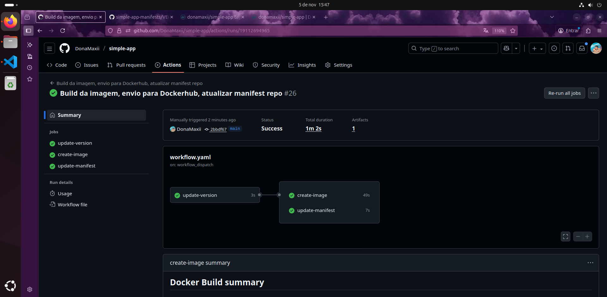

Observação: no repositório da aplicação, é necessário obedecer a seguinte estrutura de diretório ao criar um workflow para GitHub Actions:
>
    simple-app
     |___.github/workflows
         |___workflow.yaml

>

Ao fim, realizamos o *commit* das alterações, acrescentando o workflow.yaml:

>
    git add .
    git commit -m "feat: workflow"
    git push origin main
>

## 🐙 Configurando o cluster Kubernetes com ArgoCD

Com os repositórios e o GitHub Actions devidamente configurados, passamos agora à segunda parte do projeto: configurar um cluster K8S (ou Kubernetes) local com ArgoCD.

O cluster Kubernetes será estruturado com minikube, com Docker.

### 1) Instalando Docker

- Para instalar o Docker:

>
    # Adicionando a chave GPG oficial do Docker:
    sudo apt-get update
    sudo apt-get install ca-certificates curl
    sudo install -m 0755 -d /etc/apt/keyrings
    sudo curl -fsSL https://download.docker.com/linux/ubuntu/gpg -o /etc/apt/keyrings/docker.asc
    sudo chmod a+r /etc/apt/keyrings/docker.asc
>

>
    # Adicionando o repositório às fontes apt:
    echo \
    "deb [arch=$(dpkg --print-architecture) signed-by=/etc/apt/keyrings/docker.asc] https://download.docker.com/linux/ubuntu \
    $(. /etc/os-release && echo "${UBUNTU_CODENAME:-$VERSION_CODENAME}") stable" | \
    sudo tee /etc/apt/sources.list.d/docker.list > /dev/null
    sudo apt-get update
>

>
    # Instalando a versão mais recente do Docker
    sudo apt-get install docker-ce docker-ce-cli containerd.io docker-buildx-plugin docker-compose-plugin
>

- Para checar se a instalação foi bem sucedida:

>
    # Checando se a instalçação foi bem sucedida:
    sudo systemctl status docker
    sudo docker run hello-world
>

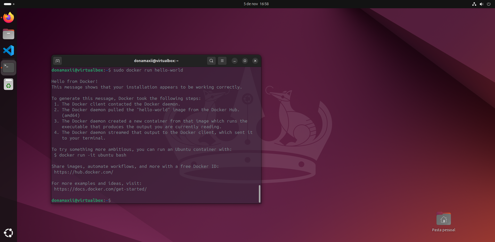

### 2) Instalando o minikube

- Para instalar o minikube (Linux x86-64):

>
    # Instalando minikube via pacote .deb:
    curl -LO https://storage.googleapis.com/minikube/releases/latest/minikube_latest_amd64.deb
    sudo dpkg -i minikube_latest_amd64.deb
>

- Para iniciar o cluster Kubernetes no minikube, basta rodar o comando:

>
    minikube start
>

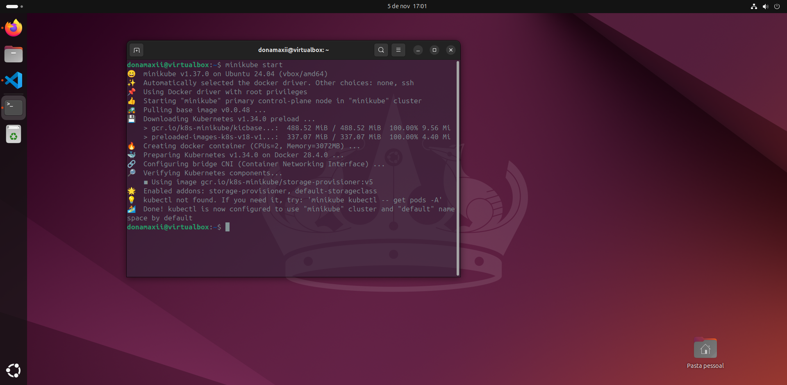

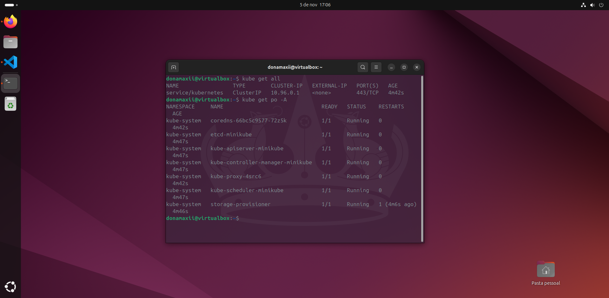

### 3) Instalando o ArgoCD

- O ArgoCD, por sua vez, será instalado no cluster com um namespace próprio.

>
    minikube kubectl create namespace argocd
    minikube kubectl -- apply -n argocd -f https://raw.githubusercontent.com/argoproj/argo-cd/stable/manifests/install.yaml
>

- Para acessar o servidor API do ArgoCD do navegador web, pode ser utilizado um port-forward:

>
    minikube kubectl -- port-forward svc/argocd-server -n argocd 8080:443
>

- No navegador web de sua preferência, digite na barra de endereços:

>
    http://localhost:8080
>

- O primeiro acesso do ArgoCD pede, para nome de usuário, o termo *"admin"*, porém exige do usuário a geração de uma primeira senha, que pode ser alterada posteriormente no painel da API. Para gerar a senha:

>
    minikube kubectl -- -n argocd get secret argocd-initial-admin-secret -o jsonpath="{.data.password}" | base64 -d; echo
>

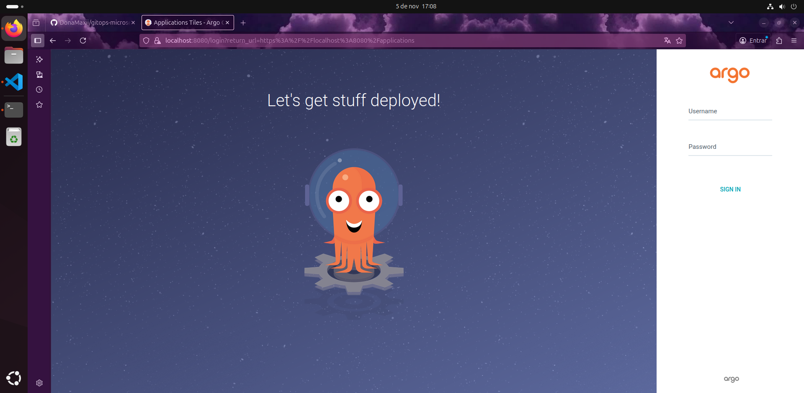

## 📥 Instalação do App no ArgoCD

Para iniciar o processo de deploy da aplicação, acesse o argoCD e realize o login. No painel principal, clique em "New App".

Na etapa *"GENERAL"*:

- Em Application name, digite **simple-app**;

- Em Project, digite **default**;

- Em Sync Policy, escolha **Automatic**, e cheque a opção **Enable Auto-Sync** para sincronização automática;

- Em sync options, marque a opção **Auto-create namespace**.

Na etapa *"SOURCE"*:

- Em Repository URL, informe o repositório manifest: **https://github.com/seu-user/simple-app-manifests**;

- Em Revision, escolha **HEAD**;

- Em PATH, defina **k8s**;

Em *"DESTINATION"*:

- Em cluster URL, informe **https://kubernetes.default.svc**;

- Em namespace, defina **simple-app**.

Por fim, clique no botão “**Create**” para iniciar o deployment da aplicação.

O processo de deployment pode levar alguns minutos até a sincronização total. É possível acompanhar em tempo real a implantação de cada objeto no ArgoCD, tanto pelo painel do ArgoCD, quanto pelo bash:

>
    minikube kubectl -- get all -n simple-app
>

Quando o processo for concluído, o painel do Argo mostrará todos os objetos do cluster devidamente instalados conforme programado no manifest YAML. Em um cenário ideal:

- Sync Status: Synced to HEAD;
- Last Sync: Sync OK to <último-commit>
- App Health: Healthy

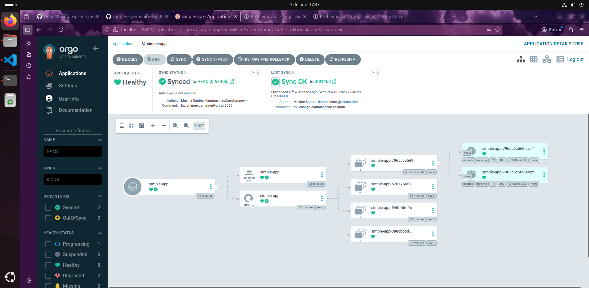

Nesse cenário, a sincronização com o repositório do manifest foi um sucesso, onde podemos verificar o ultimo *commit*, e todos os objetos estão em pleno funcionamento e devidamente conectados. 

Nesse momento, toda alteração realizada no arquivo manifest YAML será imediatamente sincronizada com o cluster local atráves do ArgoCD, uma vez que, durante a criação do app optou-se por ativar o *autosync*.

Para acessar a aplicação pelo navegador:

>
    minikube service simple-app –n simple-app
>

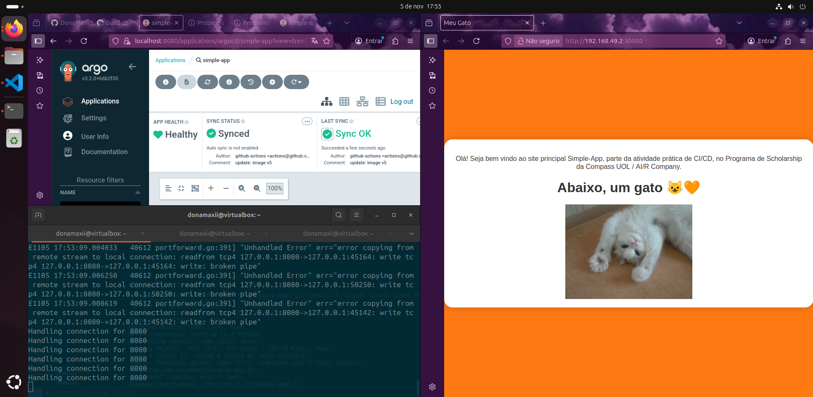

## ✅ Conclusão

Se todos os passos forem bem sucedidos, teremos instaurado um ciclo completo de CI/CD, possibilitando o desenvolvimento integrado a uma atualização contínua e automatizada do aplicativo, possibilitando aos desenvolvedores economia de tempo, agilidade na entrega das atualizações, e a redução do risco de erro humano.

Para testar se o processo está 100% funcional, experimente fazer o *commit* de uma pequena alteração na aplicação, por exemplo, alterando uma frase ou trocando uma imagem.

No momento em que o *commit* for executado no repositório da aplicação, o GitHub Actions entrará em ação enviando uma imagem atualizada para o Dockerhub e atualizando o repositório do manifesti, e este será sincronizado com o ArgoCD, que aplicará a alteração no *cluster*.

Testes finais com atualização em tempo real:

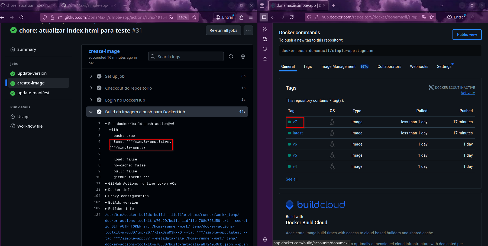

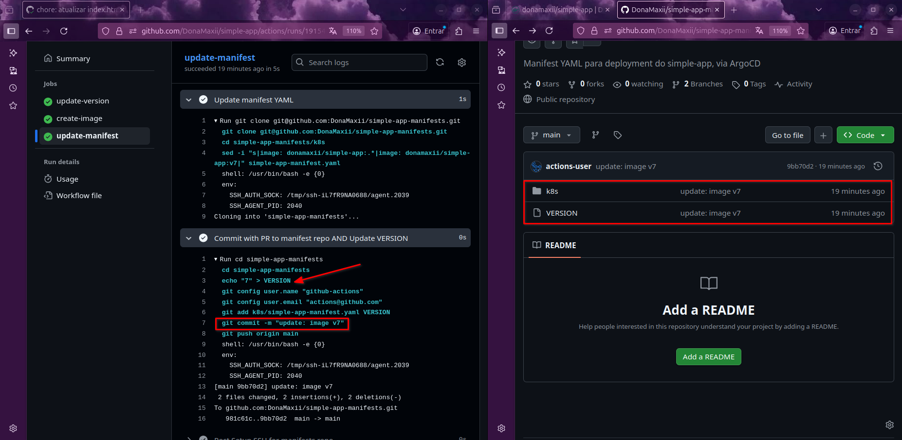

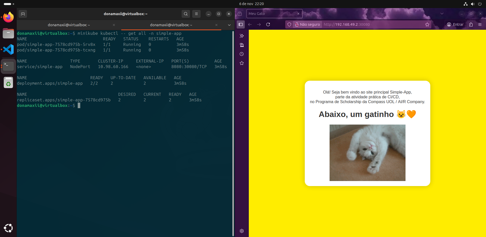
